# Моделирование одномерного уравнения теплопроводности (Метод сеток)

**Интерактивный симулятор:** [http://umutyagcioglu.com](http://umutyagcioglu.com)

В данном проекте реализовано высокопроизводительное веб-приложение для численного моделирования термодинамических процессов в одномерной среде (стержне или пластине). Главная инженерная задача — реализация **метода сеток**, обеспечение вычислительной стабильности в браузере и максимальное приближение симуляции к реальным физическим условиям.

---

## 1. Описание проекта

Проект — инструмент для визуального и численного анализа распространения тепла внутри материалов со временем. В отличие от базовых симуляторов, работающих с абстрактными величинами, эта программа оперирует реальными физическими параметрами, учитывает влияние окружающей среды и позволяет изучать сеточную сходимость численных методов без риска «падения» браузера от перегрузки.

---

## 2. Теоретическая и математическая модель (Метод сеток)

Основа симуляции — уравнение теплопроводности Фурье с внутренним источником тепла:

$$\frac{\partial T}{\partial t} = \alpha \frac{\partial^2 T}{\partial x^2} + Q$$

Для решения применён **метод сеток (конечных разностей)**. Пространство стержня разбивается на $N$ узлов с шагом $h$ (или $dx$), а время — на слои с шагом $\tau$ (или $dt$).

Изначально использовалась явная схема, что при малых $h$ (например $h=10^{-4}$) приводило к числовой неустойчивости и `NaN`. Для гарантированной устойчивости математическое ядро было переведено на **неявную разностную схему**. На каждом временном слое требуется решить трёхдиагональную систему линейных уравнений — решается методом прогонки (алгоритм Томаса).

**Пример реализации математического ядра (C):**

```c
#include <stdlib.h>

// Функция обхода сетки неявным методом
void computeNextStep(double* T_old, double* T_new, double alpha, double dt, double dx, int N) {
    double r = (alpha * dt) / (dx * dx);

    // Выделение памяти для коэффициентов прогонки
    double* a = (double*)malloc(N * sizeof(double));
    double* b = (double*)malloc(N * sizeof(double));
    double* c = (double*)malloc(N * sizeof(double));
    double* d = (double*)malloc(N * sizeof(double));

    // Инициализация сетки для внутренних узлов
    for (int i = 1; i < N - 1; i++) {
        a[i] = -r;
        b[i] = 1.0 + 2.0 * r;
        c[i] = -r;
        d[i] = T_old[i]; // правая часть (источник/предыдущее значение)
    }

    // Прямой ход (прогонка)
    for (int i = 2; i < N - 1; i++) {
        double m = a[i] / b[i - 1];
        b[i] -= m * c[i - 1];
        d[i] -= m * d[i - 1];
    }

    // Обратный ход и запись границ
    T_new[N - 1] = T_old[N - 1]; // граничное условие справа
    for (int i = N - 2; i > 0; i--) {
        T_new[i] = (d[i] - c[i] * T_new[i + 1]) / b[i];
    }
    T_new[0] = T_old[0]; // граничное условие слева

    free(a); free(b); free(c); free(d);
}
```

---

## 3. Архитектура и решение проблемы производительности

JavaScript выполняет код в основном потоке — поэтому расчёт сверхплотной сетки (например $N=4000$) на длительное время «вешал» интерфейс: графики замирали, страница не реагировала.

Решение: разделение ответственности. Главный поток отвечает только за UI и визуализацию, тяжёлая математика выполняется в фоновых потоках с помощью **Web Workers API**.

**Реализация фоновых вычислений (JavaScript / Web Worker):**

```javascript
// worker.js (Фоновый поток для обхода сетки)
self.onmessage = function(event) {
    const { T, alpha, dt, dx, steps } = event.data;
    const N = T.length;
    const r = (alpha * dt) / (dx * dx);

    let currentT = new Float64Array(T);
    let nextT = new Float64Array(N);

    // Предварительное выделение памяти (чтобы уменьшить работу GC)
    let a = new Float64Array(N), b = new Float64Array(N);
    let c = new Float64Array(N), d = new Float64Array(N);

    // Цикл по временным слоям
    for (let step = 0; step < steps; step++) {
        // Формирование коэффициентов для внутренних узлов
        for (let i = 1; i < N - 1; i++) {
            a[i] = -r;
            b[i] = 1.0 + 2.0 * r;
            c[i] = -r;
            d[i] = currentT[i];
        }

        // Прямой ход (прогонка)
        for (let i = 2; i < N - 1; i++) {
            let m = a[i] / b[i - 1];
            b[i] -= m * c[i - 1];
            d[i] -= m * d[i - 1];
        }

        // Обратный ход и запись граничных значений
        nextT[0] = currentT[0];
        nextT[N - 1] = currentT[N - 1];
        for (let i = N - 2; i > 0; i--) {
            nextT[i] = (d[i] - c[i] * nextT[i + 1]) / b[i];
        }

        // Обновляем текущий слой
        currentT.set(nextT);
    }

    // Отправка результата на главный поток для отрисовки
    self.postMessage({ resultT: currentT });
};
```

Это позволяет параллельно рассчитывать несколько конфигураций (для сравнений), не блокируя UI.

---

## 4. Повышение физической достоверности симуляции

Чтобы сделать симулятор полезным исследовательским инструментом, добавлены дополнительные физические модули.

### 4.1. Конвективный теплообмен (граничные условия 3-го рода)

Реализован закон охлаждения Ньютона: $q = h_{\text{conv}}(T_{\text{surface}} - T_{\text{ambient}})$. Края теперь остывают не мгновенно, а отдают тепло окружающей среде (воздуху, воде и т.д.). Это важно, например, при моделировании закалки.

### 4.2. Внутренние источники тепла (гауссово распределение)

Добавлена возможность задавать локальные источники тепла с гауссовым распределением по пространству — удобно для моделирования лазерного нагрева, сварки или локальных сопротивлений.

### 4.3. Продвинутая визуализация (2D Space-Time Heatmap)

Создана цветовая карта «пространство-время»: ось X — координата вдоль стержня, ось Y — время. Это даёт наглядную картину распространения тепловой волны (эффект «водопада»).

---

## 5. Сценарный анализ и сеточная сходимость

Проведены тесты стабильности метода сеток на четырёх физических сценариях. В каждом случае измерялась температура в центре при разных шагах по пространству ($h$) и времени ($\tau$).

### Сценарий 1: Асимметричный нагрев (медь)

**Условия:** медный стержень длиной 0.5 м. Начальная температура 20°C. Левый край поддерживается 300°C, правый — 20°C.  
**Цель:** проверить классическое распространение тепла и сходимость сетки. Измерение на 600-й секунде.

| Шаг $\tau$ (с) \ Шаг $h$ (м) | $h=0.1$    | $h=0.01$   | $h=0.001$  | $h=0.0001$ |
| ----------------------------: | ---------: | ---------: | ---------: | ---------: |
| $\tau=0.1$                    | 176.775 °C | 148.840 °C | 148.846 °C | 148.846 °C |
| $\tau=0.01$                   | 176.781 °C | 148.846 °C | 148.853 °C | 148.853 °C |
| $\tau=0.001$                  | 176.782 °C | 148.847 °C | 148.853 °C | 148.853 °C |
| $\tau=0.0001$                 | 176.782 °C | 148.847 °C | 148.853 °C | 148.853 °C |

**Вывод:** программа устойчива при экстремально малых шагах. Явно наблюдается сеточная сходимость: значения стабилизируются около $148.853^\circ\text{C}$.

---

### Сценарий 2: Воздушное охлаждение (сталь + конвекция)

**Условия:** стальная заготовка длиной 0.4 м, начально 800°C. Края охлаждаются взаимодействием с воздухом (температура среды 20°C).  
**Цель:** тест граничных условий (конвекция). Измерение на 2500-й секунде.

| Шаг $\tau$ (с) \ Шаг $h$ (м) | $h=0.1$    | $h=0.01$   | $h=0.001$  | $h=0.0001$ |
| ----------------------------: | ---------: | ---------: | ---------: | ---------: |
| $\tau=0.1$                    | 164.034 °C | 157.600 °C | 157.532 °C | 157.531 °C |
| $\tau=0.01$                   | 164.025 °C | 157.591 °C | 157.522 °C | 157.522 °C |
| $\tau=0.001$                  | 164.024 °C | 157.590 °C | 157.521 °C | 157.521 °C |
| $\tau=0.0001$                 | 164.024 °C | 157.590 °C | 157.521 °C | 157.521 °C |

---

### Сценарий 3: Внутренний гауссов источник тепла

**Условия:** стержень длиной 0.4 м при 0°C, в центре — локальный источник тепла.  
**Цель:** проверить обработку внутренних источников. Измерение на 3600-й секунде.

| Шаг $\tau$ (с) \ Шаг $h$ (м) | $h=0.1$   | $h=0.01$  | $h=0.001$ | $h=0.0001$ |
| ----------------------------: | --------: | --------: | --------: | ---------: |
| $\tau=0.1$                    | 22.969 °C | 18.221 °C | 18.184 °C | 18.183 °C  |
| $\tau=0.01$                   | 22.969 °C | 18.221 °C | 18.184 °C | 18.183 °C  |
| $\tau=0.001$                  | 22.969 °C | 18.221 °C | 18.184 °C | 18.183 °C  |
| $\tau=0.0001$                 | 22.969 °C | 18.221 °C | 18.184 °C | 18.183 °C  |

---

### Сценарий 4: Нагрузочный тест сетки

**Цель:** оценка многопоточности и устойчивости при длительном расчёте ($t=2000$ с) и плотной сетке.

| Шаг $\tau$ (с) \ Шаг $h$ (м) | $h=0.1$    | $h=0.01$   | $h=0.001$  | $h=0.0001$ |
| ----------------------------: | ---------: | ---------: | ---------: | ---------: |
| $\tau=0.1$                    | 315.658 °C | 216.086 °C | 216.008 °C | 216.008 °C |
| $\tau=0.01$                   | 315.659 °C | 216.083 °C | 216.002 °C | 216.002 °C |
| $\tau=0.001$                  | 315.659 °C | 216.083 °C | 216.002 °C | 216.001 °C |
| $\tau=0.0001$                 | 315.659 °C | 216.083 °C | 216.002 °C | 216.001 °C |

---

---

**First Scenario**

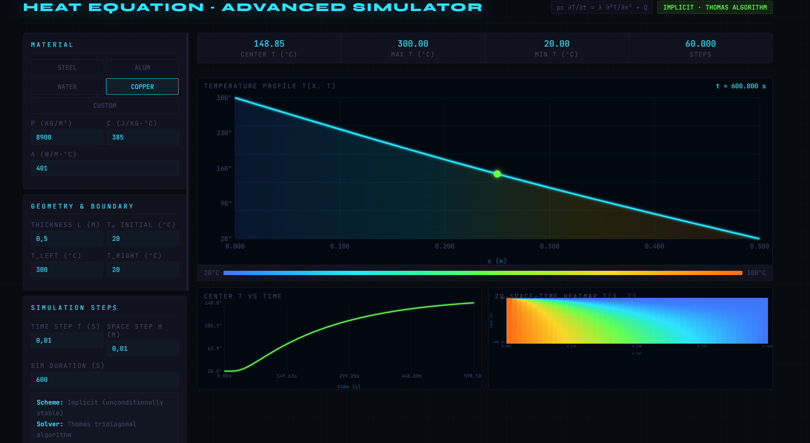 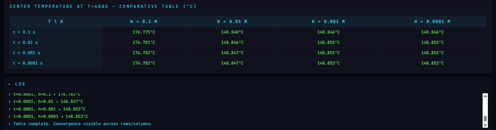

**Second Scenario**

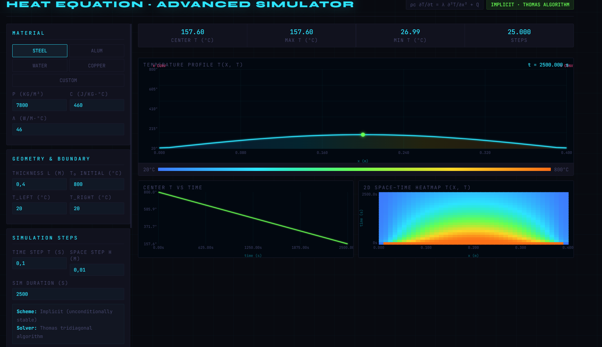 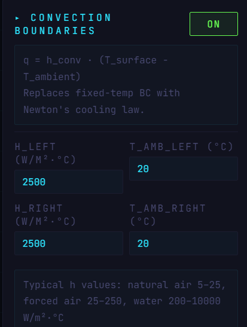 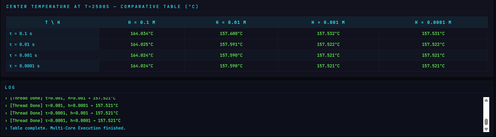

**Third Scenario**

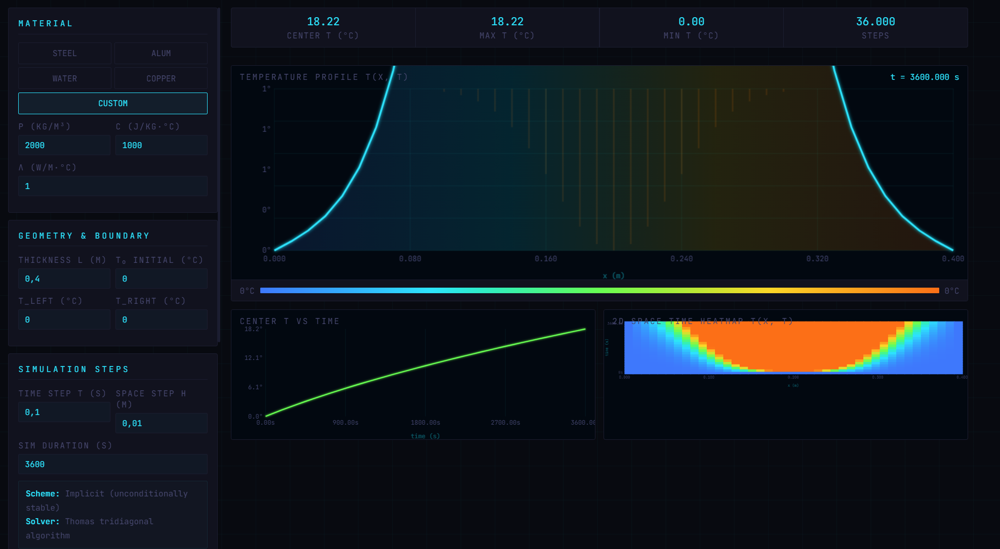 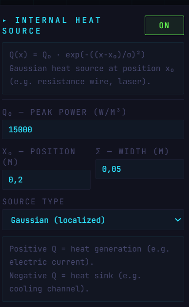 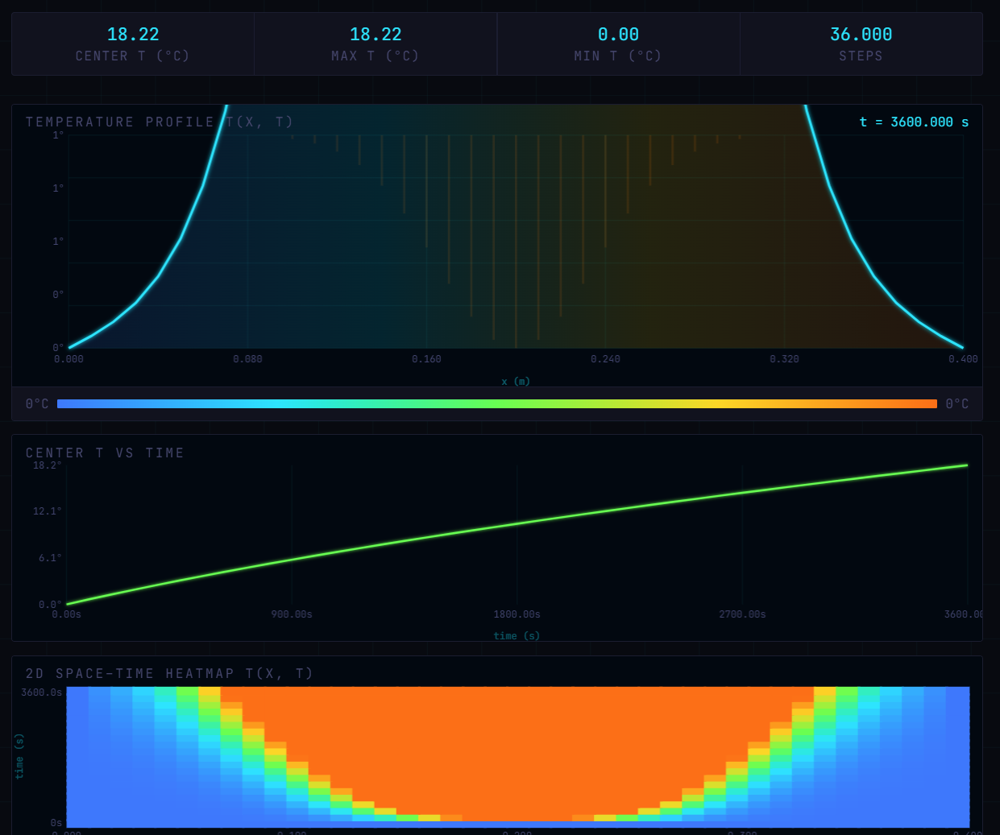 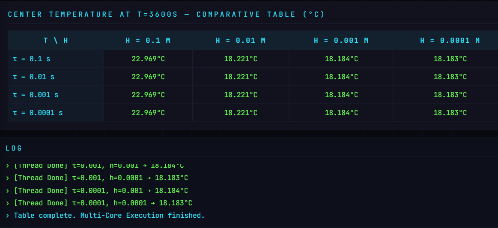

**Fourth Scenario**

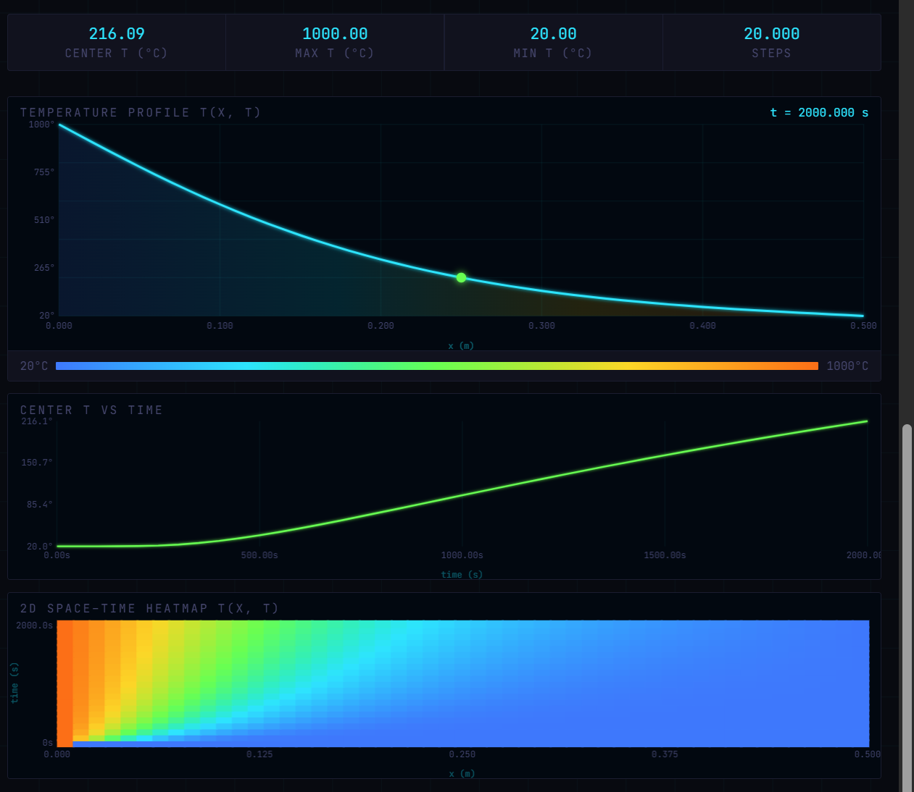 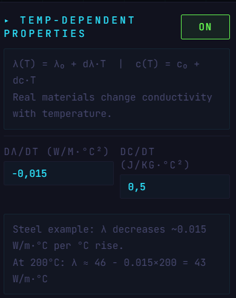 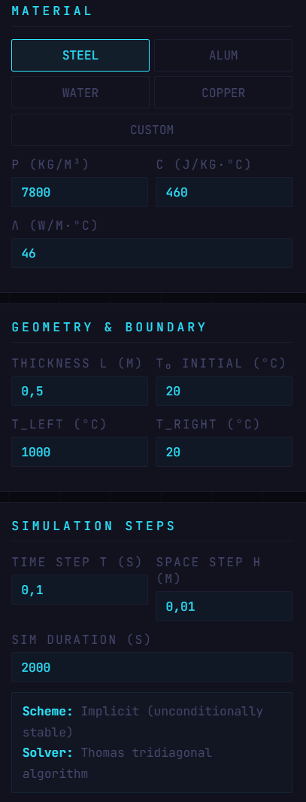 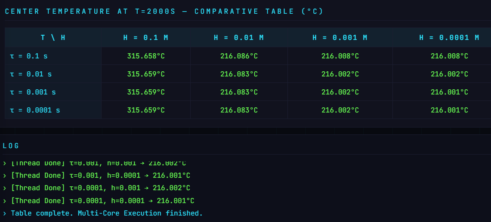

---

## 6. Общие выводы и результаты

1. **Сеточная сходимость доказана:** Из таблиц очевидно, что измельчение шага по времени ($\tau$) даёт лишь незначительные уточнения в тысячных долях. Однако шаг сетки по пространству ($h$) играет критическую роль — переход от грубой сетки (0.1) к мелкой (0.0001) устраняет погрешность вычислений на десятки градусов.
2. **Физическая точность:** Интеграция закона охлаждения Ньютона и функции внутренних источников Гаусса (Сценарии 2 и 3) позволила получать графики, полностью соответствующие законам физики (колоколообразные кривые, профили остывания).

3. **Победа над UI Freeze:** Благодаря архитектурному переходу на неявную схему (отсутствие `NaN`) и выносу метода сеток в Web Workers, симулятор работает плавно. Все тяжёлые расчёты для четырёх таблиц производятся параллельно в фоновом режиме, подтверждая эффективность многопоточного JavaScript.
