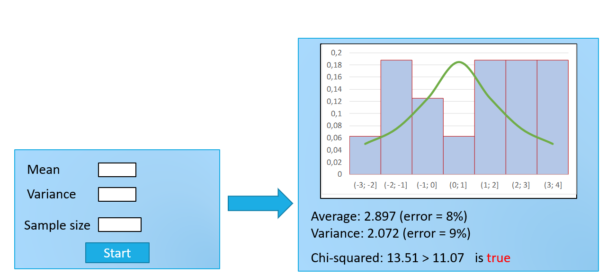

### Имитационное моделирование дискретных случайных величин (GUI)

#### lab06-1
**Задание:**
- Реализовать алгоритм проведения серии экспериментов по генерации дискретной случайной величины, заданной рядом распределения
- Вычислить эмпирические вероятности, выборочные среднее и дисперсию, их относительные погрешности
- Вычислить статистику хи-квадрат и применить критерий хи-квадрат при разных объемах выборки N  (N = 10, 100, 1 000, 10 000)
- Сделать вывод

Пример GUI:

#### lab06-2
**Задание:**
- Выполнить моделирование нормальной случайной величины любым методом. Провести статистическую обработку результатов: 

	- построить гистограмму; 
	
	- оценить точность (относительные погрешности, критерий хи-квадрат) для объемов выборки 10, 100, 1000, 10000;

   	- сделать вывод.
	
Пример GUI:	
